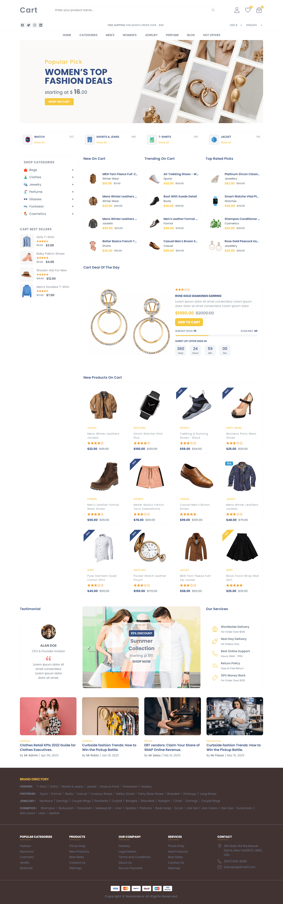

  <h1>Cart - eCommerce Website</h1>

  

    <strong>About Project:</strong> 
    A responsive eCommerce website featuring product catalogs, category filtering, and shopping cart functionality with smooth animations and mobile-friendly navigation. Built with semantic HTML5, CSS Grid and Flexbox layouts, custom CSS properties for theming, and vanilla JavaScript for interactive menus, accordions, and modal popups all organized in clean, maintainable code that online stores can easily customize, and much more.
  

  
 
    <strong>What I learned:</strong>
    Created a complete multi-section eCommerce layout with product grids, sidebar filters, implemented accordion menus with single-active state logic, built a newsletter modal with timed auto-popup animation, and developed responsive navigation with mobile slide-out menus, and much more.
  

  
 
    <strong>Personal Note:</strong>
    I started building HTML, CSS, and JavaScript projects in 2022.  
    At that time, I focused on learning first and began uploading to GitHub recently.  
    Now I'm working with <strong>React.js</strong> and <strong>Next.js</strong>, and seeking opportunities as a <strong>frontend</strong> or <strong>web developer</strong>.
  

 
  
<h2>Project More Details</h2>

  
 
    
<h4>What's Inside</h4>

    <ul>
      <li><strong>Newsletter Modal</strong> - Auto-popup subscription form with email input, close button, and timed appearance animation</li>
      <li><strong>Notification Toast</strong> - Bottom-left notification with product preview, sliding animation, and auto-dismiss timer</li>
      <li><strong>Header Navigation</strong> - Logo, search bar, user action buttons (profile, wishlist, cart with counters), and social links</li>
      <li><strong>Desktop Mega Menu</strong> - Multi-column dropdown panels with category links and product subcategories</li>
      <li><strong>Mobile Navigation</strong> - Slide-in sidebar menu with accordion categories, language/currency selectors, and social links</li>
      <li><strong>Hero Banner Slider</strong> - Horizontal scrollable promotional banners with content overlays and call-to-action buttons</li>
      <li><strong>Category Cards</strong> - Scrollable category items with icons, product counts, and quick navigation links</li>
      <li><strong>Product Sidebar</strong> - Collapsible category filters with stock counts and best seller showcase section</li>
      <li><strong>Product Showcases</strong> - Multiple product sections including New Arrivals, Trending Items, and Top Rated with horizontal scroll</li>
      <li><strong>Deal of the Day</strong> - Featured products with countdown timer, progress bar, star ratings, and add-to-cart button</li>
      <li><strong>Product Grid</strong> - Responsive grid layout with image hover effects, quick action buttons, sale badges, and price displays</li>
      <li><strong>Testimonials Section</strong> - Customer review card with profile image and quotation styling</li>
      <li><strong>CTA Banner</strong> - Promotional image with centered discount offer and shop now button</li>
      <li><strong>Services Section</strong> - Icon-based service features like worldwide delivery and return policy</li>
      <li><strong>Blog Section</strong> - Horizontal scrollable blog cards with images, categories, and publication dates</li>
      <li><strong>Footer</strong> - Brand directory, navigation links, contact information, social media, and payment methods</li>
      <li><strong>Mobile Bottom Bar</strong> - Fixed bottom navigation with menu, cart, home, wishlist, and category icons</li>
    </ul>
  

  
 
    
<h4>Technologies Used</h4>

    <ul>
      <li><strong>HTML5</strong> - Semantic markup with data attributes for JavaScript interactions and accessibility</li>
      <li><strong>CSS3</strong> - Advanced styling with Grid, Flexbox, custom properties, transforms, transitions, and animations</li>
      <li><strong>JavaScript (ES6)</strong> - Vanilla JS for modal controls, accordion menus, mobile navigation, and toast notifications</li>
      <li><strong>Google Fonts</strong> - Poppins font family for modern, clean typography across all text elements</li>
      <li><strong>Ionicons</strong> - SVG icon library for navigation, social media, and user interface elements</li>
      <li><strong>CSS Custom Properties</strong> - Variables for colors, typography, spacing, and timing for consistent theming</li>
      <li><strong>CSS Animations</strong> - Keyframe animations for popup modals, slide-in menus, and notification toasts</li>
      <li><strong>Media Queries</strong> - Responsive breakpoints at 480px, 570px, 768px, 1024px, 1200px, and 1400px</li>
      <li><strong>Flexbox & Grid</strong> - Modern layout systems for product grids, category cards, and responsive sections</li>
      <li><strong>Scroll Snap</strong> - CSS scroll-snap for smooth horizontal scrolling in product showcases and banners</li>
    </ul>
  

  
 
    
<h4>Project Structure</h4>

    <pre>
    cart-store/
    │
    ├── index.html                 # Main HTML structure with all eCommerce sections
    │
    ├── assets/
    │   ├── css/
    │   │   └── style.css         # Complete styles, animations, responsive design, and themes
    │   │
    │   ├── js/
    │   │   └── script.js         # Modal, accordion, navigation, toast functionality
    │   │
    │   └── images/               # Product images, banners, icons, blog photos, payments
    │
    └── README.md                 # Project documentation
    </pre>
  

  
 
    
<h4>Key Features</h4>

    <ul>
      <li><strong>Fully Responsive Design</strong> - Works seamlessly on all devices from 320px mobile to 1920px+ desktop screens</li>
      <li><strong>Auto-Popup Newsletter</strong> - Modal appears after 5 seconds with scale-up animation and email subscription form</li>
      <li><strong>Product Notification Toast</strong> - Sliding notification showing recent purchases with auto-dismiss after 21.5 seconds</li>
      <li><strong>Mobile-First Navigation</strong> - Full-height slide-in menu with accordion categories and smooth transitions</li>
      <li><strong>Desktop Mega Menu</strong> - Multi-column dropdown panels with category organization and hover animations</li>
      <li><strong>Horizontal Scroll Sections</strong> - Smooth scrollable product showcases with snap points for better UX</li>
      <li><strong>Accordion Filtering</strong> - Single-active accordion menus for product categories with stock display</li>
      <li><strong>Product Hover Effects</strong> - Image swap on hover, quick action buttons slide-in, and smooth transitions</li>
      <li><strong>Countdown Timer</strong> - Deal of the day section with days, hours, minutes, seconds display</li>
      <li><strong>Progress Indicators</strong> - Visual product availability bars showing sold vs available stock</li>
      <li><strong>Sale Badges</strong> - Angled and standard badges for new, sale, and discount indicators</li>
      <li><strong>Star Ratings</strong> - Product rating displays using Ionicons with filled and outline stars</li>
      <li><strong>Shopping Cart Counters</strong> - Live count badges on cart and wishlist action buttons</li>
      <li><strong>Custom Scrollbars</strong> - Styled scrollbars for better visual consistency across the site</li>
      <li><strong>Overlay System</strong> - Global overlay for modal, menu, and sidebar interactions</li>
      <li><strong>Cross-Browser Compatible</strong> - Tested on Chrome, Firefox, Safari, Edge, and Opera browsers</li>
      <li><strong>Easy Customization</strong> - CSS variables allow quick color, font, and spacing changes</li>
    </ul>
  

  
 
    
<h4>Quick Start</h4>

    <ol>
      <li>
        <strong>Clone the repository:</strong>
        <pre><code>git clone https://github.com/nawazdevx/cart-store.git</code></pre>
      </li>

      <li>
        <strong>Open the project:</strong>
        <ul>
          <li>Open <code>index.html</code> directly in your browser</li>
          <li>Or run a local server:</li>
        </ul>

        <pre><code>python -m http.server 3000</code></pre>
        Then visit <code>http://localhost:3000</code>
      </li>

      <li>
        <strong>Start Customizing:</strong>
        <ul>
          <li>Update store name and branding in <code>index.html</code></li>
          <li>Change color scheme in <code>style.css</code> using CSS variables</li>
          <li>Replace product images in <code>assets/images/</code> folder</li>
          <li>Update contact details and social links in footer section</li>
        </ul>
      </li>
    </ol>

  

  
 
    
<h4>Customization</h4>

    <ul>
      <li><strong>Text Content:</strong> Edit directly in <code>index.html</code> - update store name, product titles, descriptions, prices, and all text content</li>
      <li><strong>Colors:</strong> Update CSS variables in <code>:root</code> selector at the top of <code>style.css</code>
        <pre><code>:root {
  --slate-gray: hsl(210, 15%, 55%);          /* Text and secondary elements */
  --golden-amber: hsl(45, 90%, 60%);         /* Primary accent color */
  --steel-blue: hsl(220, 43%, 35%);          /* Primary dark color */
  --porcelain: hsl(210, 25%, 96%);           /* Light backgrounds */
}</code></pre>
      </li>
      <li><strong>Images:</strong> Replace files inside <code>assets/images/</code> with your own product photos (keep same filenames or update HTML references)</li>
      <li><strong>Fonts:</strong> Change the Google Fonts link in HTML <code>&lt;head&gt;</code> section and update font-family in CSS</li>
      <li><strong>Product Grid:</strong> Add or remove products by duplicating <code>&lt;div class="showcase"&gt;</code> elements in the product-grid section</li>
      <li><strong>Categories:</strong> Modify sidebar categories, desktop menu dropdowns, and mobile accordion menus to match your product catalog</li>
      <li><strong>Newsletter Modal:</strong> Adjust popup timing by changing the animation delay in CSS (default 5s) or disable it by removing <code>data-modal</code> attribute</li>
      <li><strong>Countdown Timer:</strong> Update timer values in HTML or connect to JavaScript for live countdown functionality</li>
      <li><strong>Footer Content:</strong> Modify brand directory links, navigation menus, contact details, and payment method logos</li>
      <li><strong>Responsive Breakpoints:</strong> Adjust media query values in CSS to customize responsive behavior for different screen sizes</li>
      <li><strong>Animations:</strong> Modify animation timing and effects in <code>@keyframes</code> sections and transition properties throughout CSS</li>
    </ul>
  

 
  <strong>License:</strong>
  This project is licensed under the <a href="https://choosealicense.com/licenses/mit/">MIT License</a>.

 
  <strong>Contact:</strong> 
  Connect with me on <a href="https://www.linkedin.com/in/nawazdevx">LinkedIn</a> or visit my <a href="https://nawazdevx.vercel.app/">Portfolio</a>.

 
  <strong>Support:</strong> 
  Found this helpful? Give it a ⭐ on GitHub! Thank you.

 

  <h2>Project Preview</h2>

  

    <strong>You can view the live project here ➜</strong>
    <a href="https://nawazdevx.github.io/cart-store/" target="_blank">
      <strong>Live Demo</strong>
    </a>
  

  

