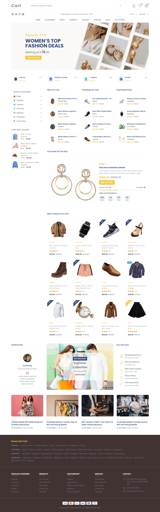

  <h1>Cart Store</h1>

  

    <strong>About the Project:</strong>
    Cart Store is a fully responsive eCommerce website UI built with HTML, CSS, and JavaScript. It covers fashion, footwear, jewelry, cosmetics, and more — designed to show real frontend skills in layout, interactivity, and clean code structure.
  

  

    <strong>Key Highlights:</strong>
    Features a multi-section product layout, animated notification toast, newsletter modal, sticky sidebar with category filters, and a countdown deal timer — all fully responsive across devices.
  

  

    <strong>Explore the project:</strong>
    Visit the <a href="https://nawazdevx.github.io/cart-store/" target="_blank">Live Website</a>
    or watch the <a href="https://nawazdevx.vercel.app/projects" target="_blank">Demo Video</a>.
  

  
<h2>Project Details</h2>

  

    
<h4>What's Inside</h4>

    <ul>
      <li><strong>Header</strong> — Logo, search bar, user actions, and desktop/mobile navigation menus.</li>
      <li><strong>Banner Slider</strong> — Horizontal scroll banner with product promotions and CTA buttons.</li>
      <li><strong>Category Bar</strong> — Scrollable category row with icons and item counts per category.</li>
      <li><strong>Product Sidebar</strong> — Accordion-based category filter with best seller product list.</li>
      <li><strong>Product Minimal</strong> — Three scrollable sections: New, Trending, and Top Rated products.</li>
      <li><strong>Deal of the Day</strong> — Featured products with stock status bar and live countdown timer.</li>
      <li><strong>Product Grid</strong> — Responsive product card grid with hover image swap and action buttons.</li>
      <li><strong>Testimonials & CTA</strong> — Customer review card, seasonal sale banner, and services section.</li>
      <li><strong>Blog Section</strong> — Scrollable blog card row with category labels and post metadata.</li>
      <li><strong>Footer</strong> — Brand directory, navigation links, contact info, and payment icons.</li>
      <li><strong>Newsletter Modal</strong> — Auto-triggered popup with email subscription form and close control.</li>
      <li><strong>Notification Toast</strong> — Animated slide-in toast showing a recent purchase notification.</li>
    </ul>
  

  

    
<h4>Key Features</h4>

    <ul>
      <li><strong>Fully Responsive Layout</strong> — Optimized for mobile, tablet, and desktop screen sizes.</li>
      <li><strong>Mobile Navigation Menu</strong> — Slide-in side menu with accordion categories for mobile users.</li>
      <li><strong>Desktop Mega Menu</strong> — Multi-column dropdown panel with hover-triggered category lists.</li>
      <li><strong>Newsletter Modal Popup</strong> — Auto-opens after 5 seconds with smooth scale-up animation.</li>
      <li><strong>Notification Toast</strong> — Slides in and out automatically on a timed animation loop.</li>
      <li><strong>Product Hover Effects</strong> — Image swap on hover with animated quick-action buttons.</li>
      <li><strong>Deal Countdown Timer</strong> — Displays days, hours, minutes, and seconds for limited offers.</li>
      <li><strong>Accordion Sidebar Filters</strong> — Expand and collapse category filters with single-active state.</li>
      <li><strong>Horizontal Scroll Sections</strong> — Snap-scroll product rows for clean mobile browsing experience.</li>
      <li><strong>Sale & New Badges</strong> — Angled ribbon-style product badges for sale and new items.</li>
    </ul>
  

  

    
<h4>Technologies Used</h4>

    <ul>
      <li><strong>HTML5</strong> — Semantic markup structure used throughout all page sections.</li>
      <li><strong>CSS3</strong> — Custom properties, flexbox, grid, animations, and full responsive design.</li>
      <li><strong>JavaScript (ES6)</strong> — Modal, toast, accordion, and mobile menu interactivity logic.</li>
      <li><strong>Google Fonts</strong> — Poppins font integrated for clean and modern typography.</li>
      <li><strong>Ionicons</strong> — Icon library used for navigation, actions, and UI elements throughout.</li>
    </ul>
  

  

    
<h4>Project Structure</h4>

    <pre>
cart-store/
│
├── index.html                 # Main HTML structure with all eCommerce sections
│
├── assets/
│   ├── css/
│   │   └── style.css          # Complete styles, animations, responsive design, and themes
│   │
│   ├── js/
│   │   └── script.js          # Modal, accordion, navigation, toast functionality
│   │
│   └── images/                # Product images, banners, icons, blog photos, payments
│
└── README.md                  # Project documentation
    </pre>
  

  

    
<h4>Quick Start</h4>

    <ol>
      <li>
        <strong>Clone the repository:</strong>
        <pre><code>git clone https://github.com/nawazdevx/cart-store.git</code></pre>
      </li>

      <li>
        <strong>Open the project:</strong>
        <ul>
          <li>Open <code>index.html</code> directly in your browser</li>
          <li>Or run a local server:</li>
        </ul>
        <pre><code>python -m http.server 3000</code></pre>
        Then visit <code>http://localhost:3000</code>
      </li>

      <li>
        <strong>Start Customizing:</strong>
        <ul>
          <li>Update banner images and text content inside <code>index.html</code></li>
          <li>Add or remove product cards in the product grid in <code>index.html</code></li>
          <li>Change colors and fonts using CSS variables at the top of <code>style.css</code></li>
          <li>Edit category names and sidebar items directly in <code>index.html</code></li>
          <li>Adjust modal delay or toast timing in <code>script.js</code></li>
        </ul>
      </li>
    </ol>

  

  <strong>License:</strong>
  This project is licensed under the <a href="https://choosealicense.com/licenses/mit/">MIT License</a>.

  <strong>Contact:</strong>
  Connect with me on <a href="https://www.linkedin.com/in/nawazdevx">LinkedIn</a> or visit my <a href="https://nawazdevx.vercel.app/">Portfolio</a>.

  <strong>Support:</strong>
  Found this helpful? Give it a ⭐ on GitHub! Thank you.

 

  <h2>Project Preview</h2>
  

